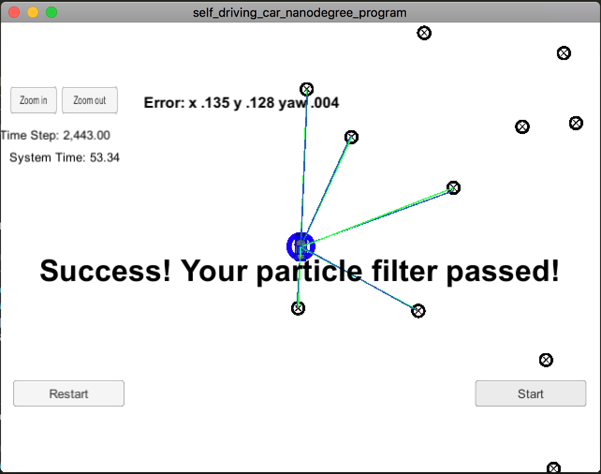

# Overview
In this project we implemented a 2 dimensional particle filter in C++. 
Our particle filter was given a map and some initial localization information (analogous to what a GPS would provide). 
At each time step your filter will also got observation and control data.

## Running the Code
To run this project, first install the Term 2 Simulator which can be downloaded [here](https://github.com/udacity/self-driving-car-sim/releases)

This repository includes two files that can be used to set up and install uWebSocketIO for either Linux or Mac systems. For windows we could use either Docker, VMware, or even Windows 10 Bash on Ubuntu to install uWebSocketIO.

Once the install for uWebSocketIO is complete, the main program can be built and ran by doing the following from the project top directory.

1. mkdir build
2. cd build
3. cmake ..
4. make
5. ./particle_filter

## Objective
Our job was to build out the methods in `particle_filter.cpp` until the simulator output says:

```
Success! Your particle filter passed!
```

# My output:

